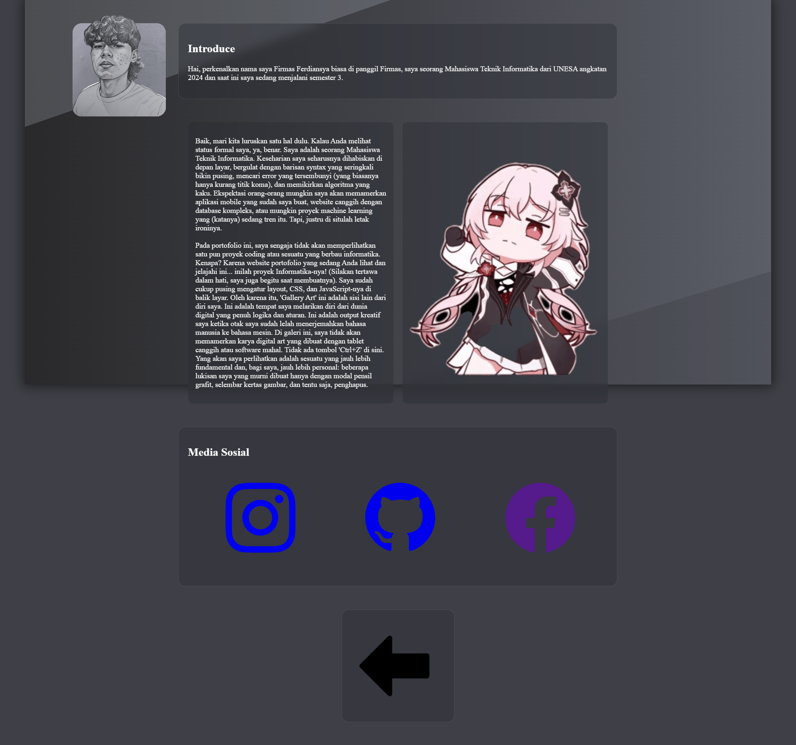

# Gallery_Art-Portofolio
```markdown
# Gallery_Art-Portofolio

link yt:
https://youtu.be/89Cm6Wf6k74

Deskripsi
---------
Gallery_Art-Portofolio adalah website portofolio sederhana untuk menampilkan karya seni dan proyek. Halaman utama dibuat dengan HTML, styling menggunakan CSS dan Bootstrap, serta interaksi sederhana menggunakan JavaScript dan AOS (Animate On Scroll).

Screenshots
-----------


## 🖼️ Galeri Proyek

Ini adalah beberapa tangkapan layar (screenshot) dari proyek saya.



Fitur
-----
- Halaman portofolio untuk menampilkan gambar dan video.
- Animasi saat scroll menggunakan AOS.
- Responsive layout dengan bantuan Bootstrap.
- Halaman tambahan: halaman-2.html, halaman-3.html.

Teknologi yang digunakan
------------------------
- HTML
- CSS
- JavaScript
- AOS (Animate On Scroll)
- Bootstrap

Cara menjalankan (development)
------------------------------
1. Buka folder proyek di editor kode (mis. VS Code).
2. Buka file `Porto.html`.
3. Jalankan "Go Live" (misal menggunakan extension Live Server di VS Code) atau buka `Porto.html` langsung di browser.
4. Jika menggunakan Live Server, akses alamat yang muncul (biasanya `http://127.0.0.1:5500/` atau `http://localhost:5500/`) untuk melihat hasil.

Struktur proyek (ringkasan)
--------------------------
- gambar/                : tempat simpan tangkapan layar & aset gambar
- vidio/                 : tempat simpan video (catatan: penamaan folder mengikuti struktur Anda)
- Build/                 : (opsional) hasil build bila ada
- Porto.html             : halaman utama portofolio (jalankan dari sini)
- halaman-2.html         : halaman tambahan
- halaman-3.html         : halaman tambahan
- program.js             : script JavaScript
- style.css              : style utama
- style2.css             : style tambahan
- style3.css              : kemungkinan typo — periksa apakah ini harus `style3.css`
- README.md              : file ini


Cara kontribusi
---------------
1. Fork repositori ini.
2. Buat branch fitur: `git checkout -b fitur/nama-fitur`.
3. Commit perubahan Anda: `git commit -m "Tambah fitur: ..."`
4. Push ke branch: `git push origin fitur/nama-fitur`.
5. Buat Pull Request.
